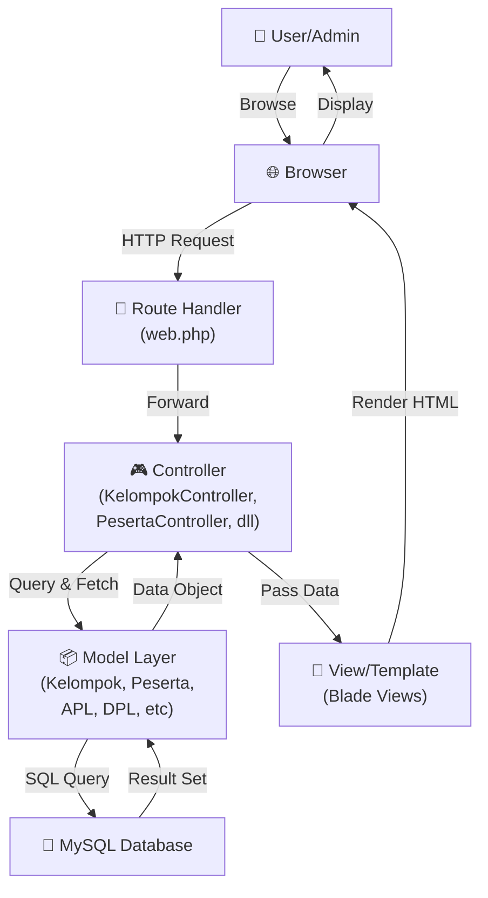
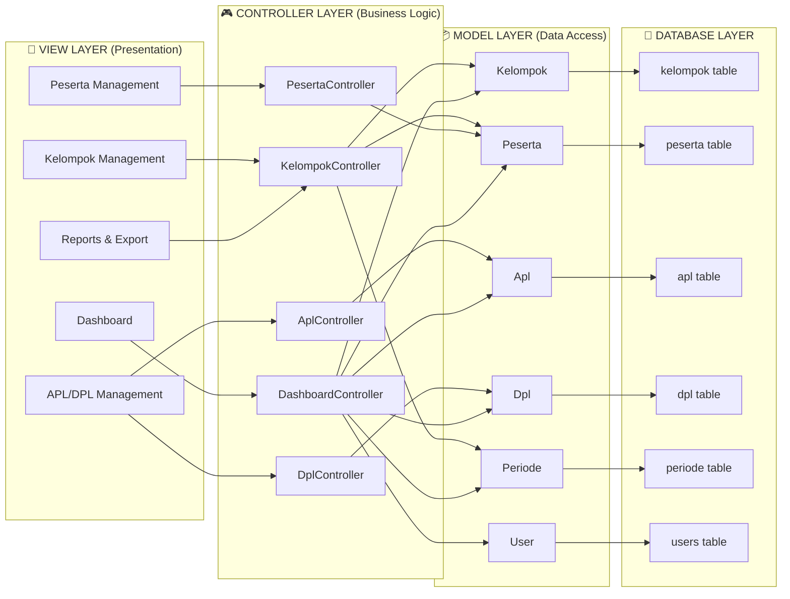
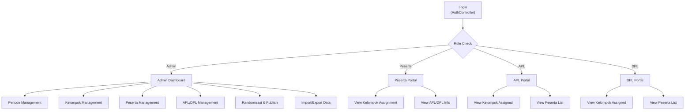
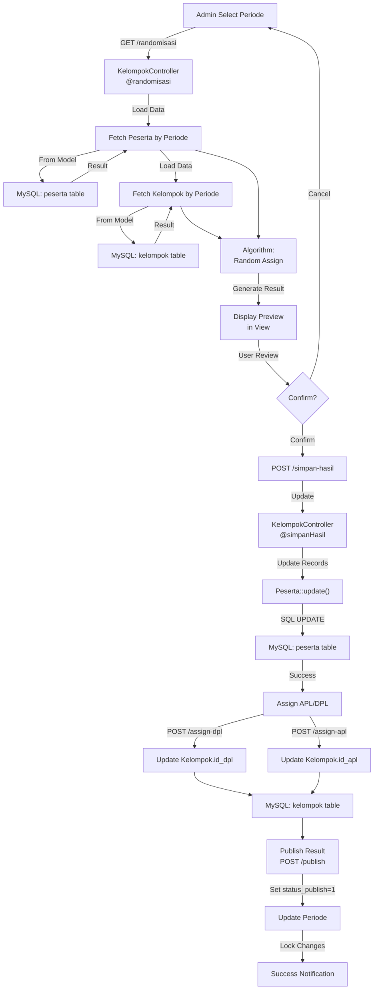
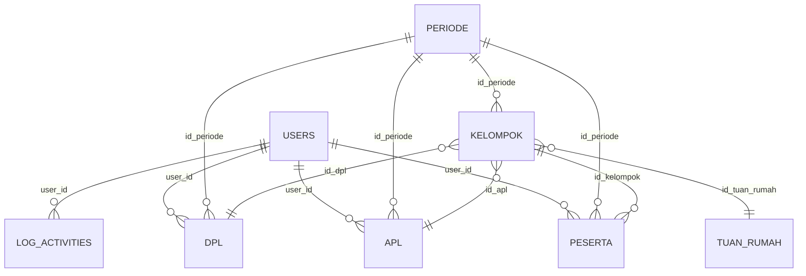
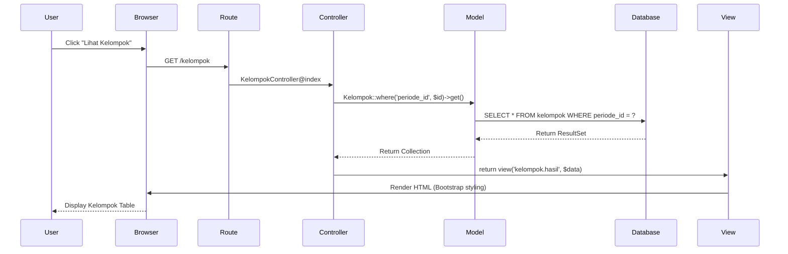
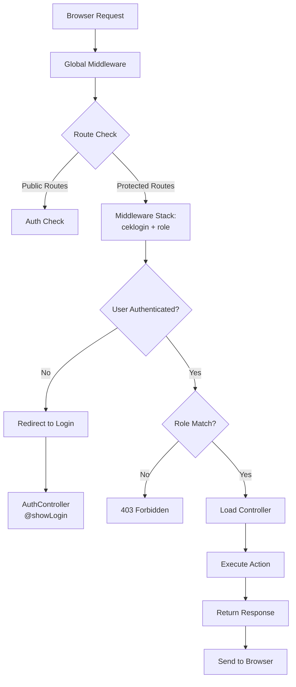
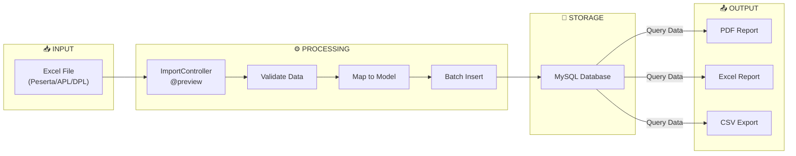
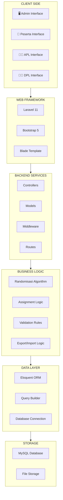

# 🎨 Visualisasi Arsitektur KKN-APP

## Diagram 1: Alur Interaksi Pengguna ke Database



## Diagram 2: MVC Architecture KKN-APP



## Diagram 3: User Role-Based Access



## Diagram 4: Data Flow - Randomisasi & Pembagian Kelompok



## Diagram 5: Database Relationships



## Diagram 6: Request-Response Cycle



## Diagram 7: Middleware & Authentication Flow



## Diagram 8: Data Import/Export Pipeline



## Diagram 9: State Transitions - Periode Status

```mermaid
stateDiagram-v2
    [*] --> Draft: Create Periode
    Draft --> Active: Activate
    Active --> RandomReady: Data Complete
    RandomReady --> Randomized: Run Randomisasi
    Randomized --> AssignmentReady: Assign APL/DPL
    AssignmentReady --> Published: Publish
    Published --> Archived: Archive
    Archived --> [*]
    
    Published -.->|Unpublish| AssignmentReady
    Active -.->|Edit| Draft
```

## Diagram 10: System Components Overview


